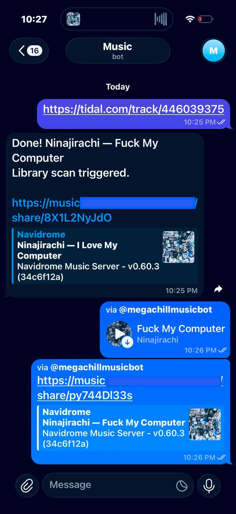

# Music Bot

Telegram bot for [Navidrome](https://www.navidrome.org/) that downloads music from Tidal via [Monochrome](https://monochrome.samidy.com), organizes your library, and shares what you're listening to.

<p align="center">
  
</p>

## Features

- **Album & track downloads** — send a Tidal or Monochrome link, get FLACs with full metadata saved to your library
- **Now Playing** — inline mode sends the currently playing track as audio
- **Share links** — inline `share` mode sends a Navidrome share link with cover art preview
- **Auto-share after download** — share link appended to the success message
- **Private** — only users listed in `ALLOWED_USERS` can interact with the bot

## Setup

Add your settings to `.env`:

```env
TG_TOKEN=your_bot_token
NAVIDROME_URL=http://host.docker.internal:4533
NAVIDROME_USER=admin
NAVIDROME_PASS=your_password
ALLOWED_USERS=123456789
```

### Docker

```yaml
services:
  music-bot:
    image: "ghcr.io/eeegoloauq/music-bot:latest"
    container_name: music-bot
    restart: unless-stopped
    volumes:
      - /media/music:/music
      - ./.env:/data/bot.env:ro
    extra_hosts:
      - "host.docker.internal:host-gateway"
```

The `.env` is mounted into the container and read directly by Python — special characters like `$` work without escaping.

If Navidrome is in the same compose stack, use `NAVIDROME_URL=http://navidrome:4533`.

### Without Docker

```bash
pip install -r requirements.txt
cp .env.example .env  # fill in values
python src/bot.py
```

## Configuration

| Variable | Required | Default | Description |
|---|---|---|---|
| `TG_TOKEN` | yes | | Telegram bot token |
| `NAVIDROME_URL` | yes | `http://localhost:4533` | Navidrome URL (internal) |
| `NAVIDROME_USER` | yes | | Navidrome username |
| `NAVIDROME_PASS` | yes | | Navidrome password |
| `ALLOWED_USERS` | yes | | Comma-separated Telegram user IDs |
| `MUSIC_DIR` | | `/music` | Music library path in container |
| `STREAM_BITRATE` | | `320` | MP3 bitrate for inline audio (kbps) |
| `NAVIDROME_PUBLIC_URL` | | | Public Navidrome URL for share links (e.g. `https://music.example.com`). Sharing disabled if not set. |

### Proxy

If Tidal CDN is blocked in your region, set proxy variables. Make sure Navidrome host is excluded:

```env
HTTP_PROXY=http://your-proxy:1080
HTTPS_PROXY=http://your-proxy:1080
NO_PROXY=localhost,127.0.0.1,192.168.1.0/24,host.docker.internal
```

### Sharing

To enable share links, set `NAVIDROME_PUBLIC_URL` and enable sharing in Navidrome (`ND_ENABLESHARING=true`).

## Usage

- Send a `tidal.com/album/...` or `tidal.com/track/...` link to download
- Type `@yourbotname` in any chat — sends currently playing track as audio
- Type `@yourbotname share` — sends a Navidrome share link with cover art embed

## Tags

All metadata is written automatically to downloaded FLACs: artist, album, title, track/disc numbers, date, copyright, ISRC, UPC, BPM, ReplayGain, cover art. Existing tags are never overwritten.
