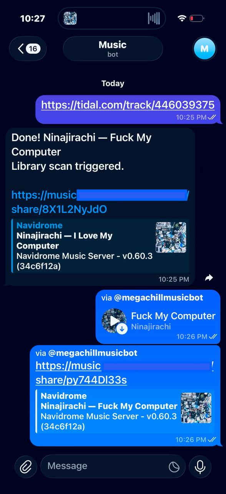

# Music Bot

[](https://github.com/eeegoloauq/music-bot/releases)
[](https://github.com/eeegoloauq/music-bot/pkgs/container/music-bot)

Telegram bot that builds and manages a [Navidrome](https://www.navidrome.org/) music library — download from Tidal (via [Monochrome](https://monochrome.samidy.com)), Spotify, Apple Music, Shazam and more, search and delete albums, share now playing.

<p align="center">
  
  <br>
  <em>Album download with metadata tagging and share link</em>
</p>

## Features

- **Album & track downloads** — send a Tidal, Spotify, Apple Music, Deezer, YouTube Music, SoundCloud, Amazon Music, or Shazam link, get FLACs with full metadata saved to your library
- **Batch download** — send multiple links in one message
- **Force re-download** — add `re` after link to re-download existing albums/tracks
- **Inline mode** — type `@yourbotname` in any chat:
  - **Search** — just type a name to find albums and tracks on Tidal
  - **Now playing** (`np`) — sends the currently playing track as audio
  - **Share** (`s`) — sends a Navidrome share link with cover art preview
  - **Lyrics** (`l`) — shows lyrics for the current track
  - **Library search** (`lib name`) — search your Navidrome library
  - **Delete** (`del name`) — remove albums from your library
- **Auto-share** — share link with cover art appended to download results
- **Private** — only users listed in `ALLOWED_USERS` can interact with the bot

## Setup

Add your settings to `.env`:

```env
TG_TOKEN=your_bot_token
NAVIDROME_URL=http://host.docker.internal:4533
NAVIDROME_USER=admin
NAVIDROME_PASS=your_password
ALLOWED_USERS=123456789
```

### Docker

```yaml
services:
  music-bot:
    image: "ghcr.io/eeegoloauq/music-bot:latest"
    container_name: music-bot
    restart: unless-stopped
    volumes:
      - /media/music:/music
      - ./.env:/data/bot.env:ro
    extra_hosts:
      - "host.docker.internal:host-gateway"
```

The `.env` is mounted into the container and read directly by Python — special characters like `$` work without escaping.

If Navidrome is in the same compose stack, use `NAVIDROME_URL=http://navidrome:4533`.

### Without Docker

```bash
pip install -r requirements.txt
sudo apt install ffmpeg  # required for hi-res FLAC remuxing
cp .env.example .env  # fill in values
python src/bot.py
```

## Configuration

| Variable | Required | Default | Description |
|---|---|---|---|
| `TG_TOKEN` | yes | | Telegram bot token |
| `NAVIDROME_URL` | yes | `http://localhost:4533` | Navidrome URL (internal) |
| `NAVIDROME_USER` | yes | | Navidrome username |
| `NAVIDROME_PASS` | yes | | Navidrome password |
| `ALLOWED_USERS` | yes | | Comma-separated Telegram user IDs |
| `MUSIC_DIR` | | `/music` | Music library path in container |
| `STREAM_BITRATE` | | `320` | MP3 bitrate for inline audio (kbps) |
| `NAVIDROME_PUBLIC_URL` | | | Public Navidrome URL for share links (e.g. `https://music.example.com`). Sharing disabled if not set. |
| `QUALITY` | | `LOSSLESS` | Download quality: `LOSSLESS` (16-bit FLAC) or `HI_RES_LOSSLESS` (24-bit, saved as `.m4a`). Falls back to `LOSSLESS` if no instance supports hi-res. |
| `WRITE_TAGS` | | `true` | Set to `false` to skip writing metadata tags (useful if you prefer your own tagger). |

### Proxy

If Tidal CDN is blocked in your region, set proxy variables. Make sure Navidrome host is excluded:

```env
HTTP_PROXY=http://your-proxy:1080
HTTPS_PROXY=http://your-proxy:1080
NO_PROXY=localhost,127.0.0.1,192.168.1.0/24,host.docker.internal
```

### Sharing

To enable share links, set `NAVIDROME_PUBLIC_URL` and enable sharing in Navidrome (`ND_ENABLESHARING=true`).

## Usage

**Download** — send a Tidal link or any supported music link. Add `hi` for hi-res, `re` to force re-download.

**Inline mode:**

| Query | Action |
|---|---|
| `@bot song name` | Search Tidal |
| `@bot np` | Now playing as audio |
| `@bot s` | Share link for current track |
| `@bot l` | Lyrics for current track |
| `@bot lib name` | Search Navidrome library |
| `@bot del name` | Delete album from library |

**Commands:** `/scan` — library rescan, `/stats` — library statistics

## Tags

Metadata is written automatically to downloaded files. FLAC downloads get Vorbis Comment tags; hi-res `.m4a` downloads get iTunes-compatible tags. Tags written: artist, album, title, track/disc numbers, date, copyright, ISRC, UPC, BPM, ReplayGain, cover art, lyrics (from lrclib.net). Existing tags are never overwritten.
