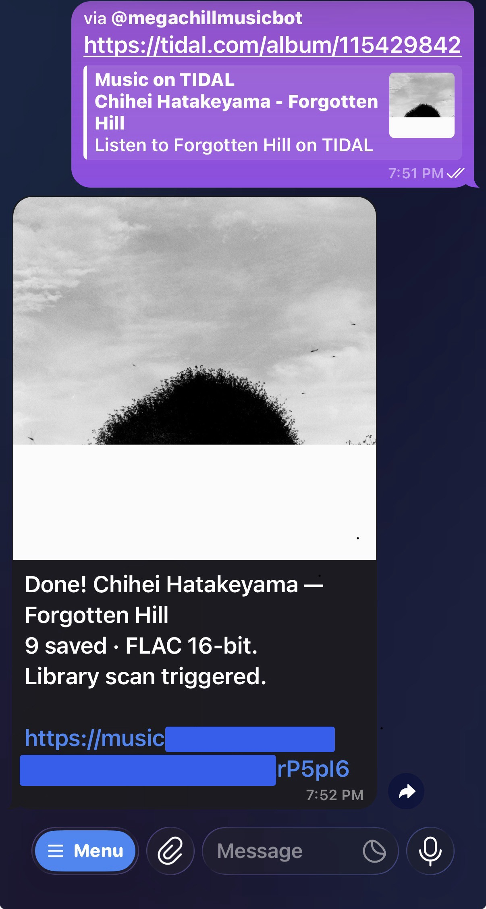

# Music Bot

[](https://github.com/eeegoloauq/music-bot/releases)
[](https://github.com/eeegoloauq/music-bot/pkgs/container/music-bot)

Telegram bot that builds and maintains a [Navidrome](https://www.navidrome.org/) music library — paste a music link from any major platform, the bot resolves it via [Deezer](https://www.deezer.com/)'s open API, downloads the audio from [Soulseek](https://www.slsknet.org/) peers via [slskd](https://github.com/slskd/slskd), tags the files with canonical metadata, and drops them into your library.

<h2 align="center">Search to download</h2>
<p align="center">
  
</p>

<h2 align="center">Download into your library</h2>
<p align="center">
  
</p>

<h2 align="center">Share what you're listening to</h2>
<p align="center">
  
</p>

## Features

- **Album & track downloads** — paste a Tidal, Spotify, Apple Music, Deezer, YouTube Music, SoundCloud, Amazon Music, or Shazam link, get FLAC files with full metadata into your library
- **mp3 fallback** — when no peer offers FLAC, the bot offers mp3 ≥ 320 kbps via inline keyboard (opt-in, no silent quality downgrade)
- **Genres from two sources** — Deezer's structured genres + Last.fm community tags merged into the GENRE field for fine-grained Navidrome facets ("witch house", "future garage", "drumless")
- **Library re-tagger** — `/retag` walks the whole library and refreshes tags from current Deezer + Last.fm metadata in place; surgical writes preserve embedded pictures and don't rewrite audio data
- **Inline mode** — type `@yourbotname` in any chat:
  - `song name` — search Deezer for albums and tracks
  - `np` — sends the currently playing track as audio
  - `s` — share link for current track with cover art
  - `l` — lyrics for current track
  - `lib name` — search your Navidrome library
  - `del name` — remove an album from your library
- **Auto-share** — share link with cover art appended to download results
- **Force re-download** — add `re` after the link
- **Private** — only users listed in `ALLOWED_USERS` can interact

## Setup

### Docker compose

The bot runs alongside slskd (Soulseek daemon) which it talks to over its REST API. Drop this `compose.yaml` next to a `.env` (see [.env.example](.env.example)) and you're done — every host-specific knob lives in `.env`, the compose file itself doesn't need editing.

```yaml
services:
  slskd:
    image: slskd/slskd:latest
    container_name: slskd
    restart: unless-stopped
    environment:
      SLSKD_SLSK_USERNAME: ${SOULSEEK_USERNAME}
      SLSKD_SLSK_PASSWORD: ${SOULSEEK_PASSWORD}
      SLSKD_SLSK_LISTEN_PORT: ${SLSKD_LISTEN_PORT:-50300}
      # Filesystem layout is canonical here so a fresh slskd.yml without a
      # `directories:` block can't break the staging contract with music-bot.
      SLSKD_DOWNLOADS_DIR: /downloads
      SLSKD_INCOMPLETE_DIR: /downloads/.incomplete
      SLSKD_NO_AUTH: "true"
    volumes:
      - ./slskd-config:/app
      - ${MUSIC_LIBRARY_DIR:-/media/music}/.slskd-downloads:/downloads
      - ${MUSIC_LIBRARY_DIR:-/media/music}:/shared:ro
    ports:
      - 127.0.0.1:5030:5030
      - ${SLSKD_LISTEN_PORT:-50300}:${SLSKD_LISTEN_PORT:-50300}
    healthcheck:
      test:
        - CMD-SHELL
        - wget -qO- http://localhost:5030/api/v0/server | grep -q
          '"isLoggedIn":true' || exit 1
      interval: 5s
      timeout: 3s
      retries: 30
      start_period: 15s

  music-bot:
    image: ghcr.io/eeegoloauq/music-bot:latest
    container_name: music-bot
    restart: unless-stopped
    env_file: .env
    environment:
      SLSKD_HOST: http://slskd:5030
      SLSKD_DOWNLOAD_DIR: /music/.slskd-downloads
      # Quality cap. 24/96 covers reasonable hi-res; 16/44100 for redbook-only.
      MAX_BIT_DEPTH: ${MAX_BIT_DEPTH:-24}
      MAX_SAMPLE_RATE_HZ: ${MAX_SAMPLE_RATE_HZ:-96000}
    volumes:
      - ${MUSIC_LIBRARY_DIR:-/media/music}:/music
    extra_hosts:
      - host.docker.internal:host-gateway
    depends_on:
      slskd:
        condition: service_healthy
```

The `slskd-config/slskd.yml` referenced by the bind mount only needs to declare `shares.directories`, `web.port`, and any peer filters you want — the staging-path config (`directories.downloads` / `directories.incomplete`) is supplied via the env vars above and overrides the yml. A minimal `slskd.yml`:

```yaml
remote_configuration: false

soulseek:
  description: "music collector"

shares:
  directories:
    - "/shared"
    - "!/shared/.slskd-downloads"
    - "!/shared/lost+found"

web:
  authentication:
    disabled: true
  port: 5030
  https:
    disabled: true
```

slskd's web UI sits on `127.0.0.1:5030` (no auth — internal docker network only). The peer port (default `50300`, set via `SLSKD_LISTEN_PORT` in `.env`) needs an inbound port forward on your router so remote peers can reach you. The `depends_on: condition: service_healthy` block waits for slskd to finish logging into the Soulseek network before the bot starts — first-message searches won't see an empty peer pool.

### .env

```env
TG_TOKEN=your_telegram_bot_token
NAVIDROME_URL=http://host.docker.internal:4533
NAVIDROME_USER=admin
NAVIDROME_PASS=your_password
ALLOWED_USERS=123456789

# Host path holding the music library AND the staging dir
# (.slskd-downloads/). Both must be on the same filesystem so the
# post-download import is an atomic rename.
MUSIC_LIBRARY_DIR=/media/music

SOULSEEK_USERNAME=your_slsk_username
SOULSEEK_PASSWORD=your_slsk_password

# Optional: change if 50300 is already in use or you've forwarded a
# different port on your router for Soulseek.
SLSKD_LISTEN_PORT=50300
```

If Navidrome is in the same compose stack, use `NAVIDROME_URL=http://navidrome:4533`. The `.env` is loaded by Python directly — special characters like `$` work without escaping.

### Without Docker

```bash
pip install -r requirements.txt
cp .env.example .env  # fill in values
# also need slskd running and reachable; see https://github.com/slskd/slskd
python src/bot.py
```

## Configuration

| Variable | Required | Default | Description |
|---|---|---|---|
| `TG_TOKEN` | yes | | Telegram bot token (from @BotFather) |
| `NAVIDROME_URL` | yes | `http://localhost:4533` | Navidrome internal URL |
| `NAVIDROME_USER` | yes | | Navidrome username |
| `NAVIDROME_PASS` | yes | | Navidrome password |
| `ALLOWED_USERS` | yes | | Comma-separated Telegram user IDs |
| `SOULSEEK_USERNAME` | yes | | Soulseek account username |
| `SOULSEEK_PASSWORD` | yes | | Soulseek account password |
| `MUSIC_LIBRARY_DIR` | | `/media/music` | **Host** path to the music library — used by compose to bind-mount into both containers. The library and the `.slskd-downloads/` staging dir live here on the same filesystem (atomic rename on import). |
| `SLSKD_LISTEN_PORT` | | `50300` | Soulseek peer port. Forward this on your router for inbound peer connections. |
| `MUSIC_DIR` | | `/music` | Container-internal mount point the bot looks for the library at. Don't override unless you also adjust the music-bot volume mapping. |
| `STREAM_BITRATE` | | `320` | MP3 bitrate Navidrome transcodes to for the inline `np` audio (kbps) |
| `NAVIDROME_PUBLIC_URL` | | | Public Navidrome URL for share links. Sharing disabled if not set. |
| `LASTFM_API_KEY` | | | Last.fm API key — when set, community tags get merged into album genres. Free at https://www.last.fm/api/account/create |
| `MAX_BIT_DEPTH` | | `24` | Soulseek peer files exceeding this bit depth are filtered out. `16` for redbook-only deployments. |
| `MAX_SAMPLE_RATE_HZ` | | `96000` | Same idea for sample rate. `44100` pairs with `MAX_BIT_DEPTH=16` for CD-quality only. |
| `MAX_FILE_BYTES` | | `2147483648` | Hard upper bound on a single peer file (default 2 GiB). `0` disables the cap. |
| `SLSKD_HOST` | | `http://slskd:5030` | slskd REST API URL |
| `SLSKD_DOWNLOAD_DIR` | | `/music/.slskd-downloads` | Where slskd writes completed downloads (mounted into both containers) |
| `SLSKD_API_KEY` | | `anonymous` | Pass-through value when slskd has `SLSKD_NO_AUTH=true`; any non-empty string works |

### Proxy

Every aiohttp session uses `trust_env=True`, so `HTTP_PROXY` / `HTTPS_PROXY` / `NO_PROXY` from the environment are respected. If a specific upstream throttles your proxy IP (Odesli, Deezer CDN, lrclib are common offenders), add the host to `NO_PROXY` so that one endpoint goes direct while everything else keeps using the proxy.

```env
HTTP_PROXY=http://your-proxy:1080
HTTPS_PROXY=http://your-proxy:1080
NO_PROXY=localhost,127.0.0.1,host.docker.internal,slskd,api.deezer.com,api.song.link,lrclib.net
```

### Sharing

For `s` (share) and auto-share to work, set `NAVIDROME_PUBLIC_URL` and enable sharing in Navidrome (`ND_ENABLESHARING=true`). The bot reuses the share if you've already created one for the album.

## Usage

### Downloads

Send a music link in chat. The bot resolves it through Deezer, finds matching peers on Soulseek, downloads, tags, and triggers a Navidrome rescan.

- Single track or full album link — auto-detected
- Multiple links in one message — all queued
- `re` after a link — force re-download (existing files preserved as `.bak` in case the new download fails)
- If no peer has FLAC, the bot offers an mp3 ≥ 320 kbps fallback as an inline keyboard prompt

### Inline mode

| Query | Action |
|---|---|
| `@bot song name` | Search Deezer for albums and tracks |
| `@bot np` | Now playing as audio (transcoded to mp3 at `STREAM_BITRATE`) |
| `@bot s` | Share link for current track |
| `@bot l` | Lyrics for current track |
| `@bot lib name` | Search your Navidrome library |
| `@bot del name` | Delete an album from your library |

### Commands

- `/help` — full feature list
- `/scan` — trigger a Navidrome library rescan
- `/stats` — library statistics (artists, albums, tracks, total size)
- `/retag` — refresh tags on every album in the library from current Deezer + Last.fm metadata (dry-run pass first, then `/retag confirm` to apply, or `/retag stop` to drop the pending session)

## Tags

Metadata is written to every downloaded file:

- **FLAC** — Vorbis Comments
- **M4A** — iTunes-style atoms with `----:com.apple.iTunes:` freeform fields for non-standard tags
- **MP3** — ID3v2.4 frames

Fields covered: artist, albumartist, album, title, track / disc number, total tracks / discs, date / year / originaldate / releasedate (the four-field quartet keeps Navidrome from splitting FLAC and M4A copies of the same album into separate entries), copyright, ISRC, UPC, label, releasetype, BPM, multi-value GENRE (Deezer + Last.fm), ReplayGain track + album gain (from Deezer's gain field), embedded cover art, and lyrics from [lrclib.net](https://lrclib.net).

The download path uses force-mode tagging (peer-supplied tags get wiped and replaced with canonical Deezer-derived values) but preserves a small allow-list — `composer`, `lyricist`, `performer`, and any peer comment is appended to the bot's identifier in the comment field. Re-tagging via `/retag` is fully surgical: it only updates fields that differ from canonical, so embedded pictures and any unmanaged tag stay intact.
