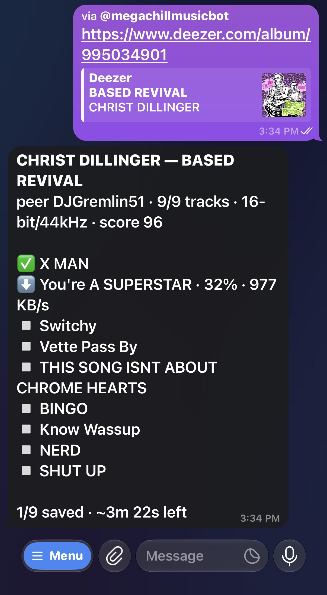
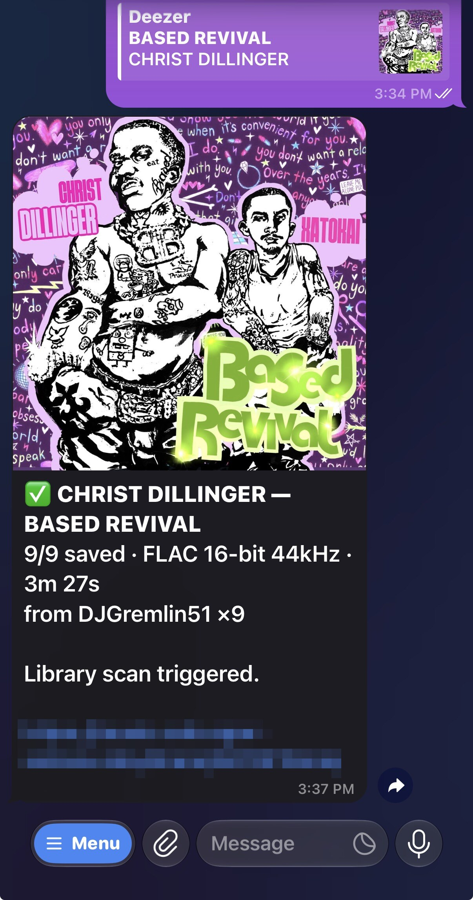
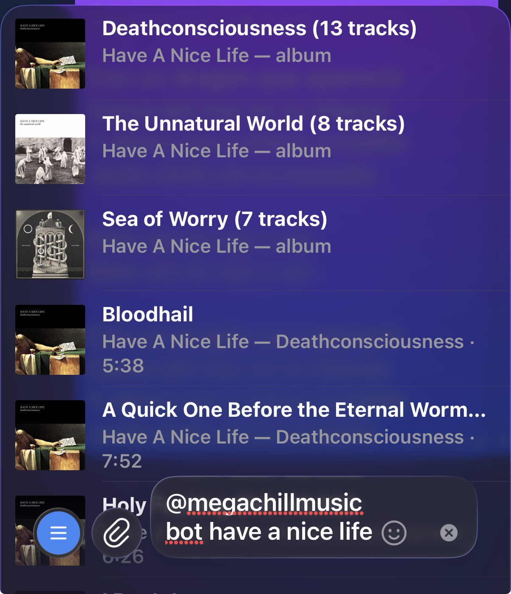
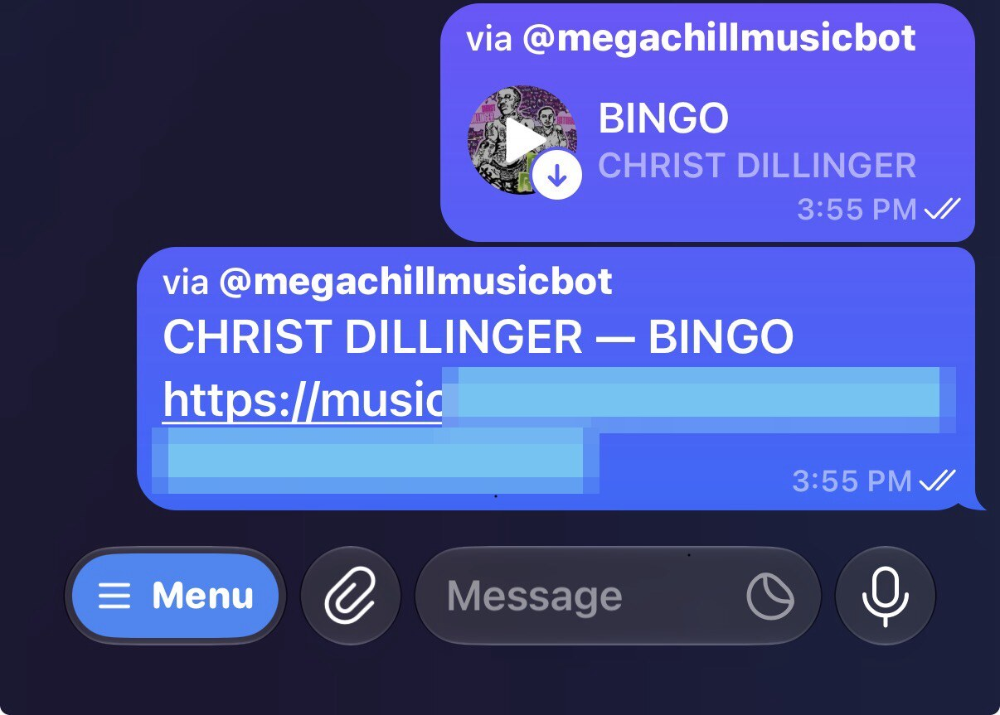
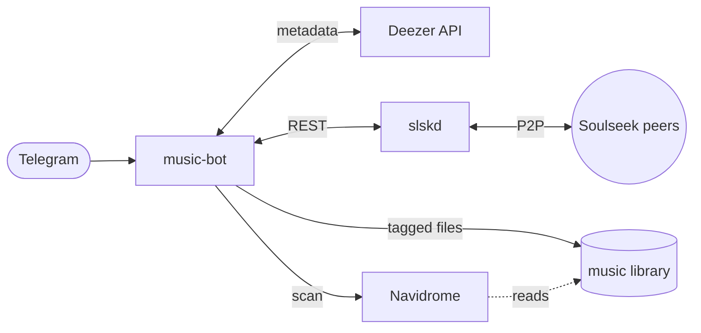

# Music Bot

[](https://github.com/eeegoloauq/music-bot/actions/workflows/tests.yml)
[](https://github.com/eeegoloauq/music-bot/releases)
[](https://github.com/eeegoloauq/music-bot/pkgs/container/music-bot)
[](LICENSE)

A Telegram bot that fills your [Navidrome](https://www.navidrome.org/) library. Paste a link to an
album or track from almost any music service and the bot figures out what it is, finds the audio on
[Soulseek](https://www.slsknet.org/), tags it properly, and drops the files into your library. A
minute later it's playing in Navidrome.

It uses [Deezer](https://www.deezer.com/)'s open API for metadata (no login, no token) and downloads
from Soulseek peers through [slskd](https://github.com/slskd/slskd).

<h2 align="center">Paste a link, get the album</h2>
<p align="center">
  
  
</p>
<p align="center"><sub>The bot edits one status message the whole way: which peer it picked, each track
as it lands, and what you actually got in the end.</sub></p>

<h2 align="center">Search from any chat</h2>
<p align="center">
  
</p>
<p align="center"><sub>Type <code>@yourbot</code> and a name in any chat, tap a result — the download
starts.</sub></p>

<h2 align="center">Share what you're playing</h2>
<p align="center">
  
</p>
<p align="center"><sub><code>np</code> sends the track you're playing as audio, <code>s</code> a share link
from your Navidrome, <code>l</code> the lyrics.</sub></p>

## What it can do

- **Download albums and tracks.** Paste a link from Tidal, Spotify, Apple Music, Deezer, YouTube
  Music, SoundCloud, Amazon Music, or Shazam. You get FLAC with full metadata in your library.
- **mp3 fallback.** If no peer has a lossless copy, the bot offers you an mp3 (≥ 320 kbps) with a
  tap — it never silently downgrades quality on you.
- **Picky about sources.** Every candidate file is duration-checked against Deezer track by track and
  scored on match confidence and peer reliability before anything is queued. The full policy is
  written up in [docs/source-selection.md](docs/source-selection.md).
- **Good genres.** Deezer's genres plus Last.fm community tags, so Navidrome gets useful tags like
  "witch house" or "future garage" instead of just "Electronic".
- **Re-tag your library.** `/retag` walks everything you already have and refreshes the tags from
  current metadata, without touching the audio or your embedded cover art.
- **Inline search.** Type `@yourbot` in any chat to search, share what you're playing, grab lyrics,
  or search your own library.
- **Private.** Only the Telegram user IDs you list can use it.

## Setup

You need two containers: **slskd** (the Soulseek client) and **music-bot** itself. They talk over
slskd's REST API. Two files is the whole setup — `compose.yaml` and `.env` — so it also works fine
in Dockge or Portainer. Everything you'd want to change lives in `.env`.


```mermaid
flowchart LR
    tg([Telegram]) --> bot[music-bot]
    bot <-->|metadata| dz[Deezer API]
    bot <-->|REST| slskd[slskd]
    slskd <-->|P2P| peers((Soulseek peers))
    bot -->|tagged files| lib[(music library)]
    bot -->|scan| nd[Navidrome]
    nd -.reads.-> lib
```

### 1. `compose.yaml`

```yaml
services:
  slskd:
    image: slskd/slskd:latest
    container_name: slskd
    restart: unless-stopped
    environment:
      SLSKD_SLSK_USERNAME: ${SOULSEEK_USERNAME}
      SLSKD_SLSK_PASSWORD: ${SOULSEEK_PASSWORD}
      SLSKD_SLSK_LISTEN_PORT: ${SLSKD_LISTEN_PORT:-50300}
      # Download paths are set here (not in slskd.yml) so the bot and slskd
      # always agree on where files land.
      SLSKD_DOWNLOADS_DIR: /downloads
      SLSKD_INCOMPLETE_DIR: /downloads/.incomplete
      SLSKD_NO_AUTH: "true"
      # Soulseek etiquette: share your library back, read-only. Remove this
      # line if you'd rather not share anything.
      SLSKD_SHARED_DIR: "/shared;!/shared/.slskd-downloads;!/shared/lost+found"
      SLSKD_SLSK_DESCRIPTION: "music collector"
    volumes:
      # slskd state — it drops an auto-generated slskd.yml here on first run,
      # you don't need to create or edit anything in it.
      - ./slskd-config:/app
      - ${MUSIC_LIBRARY_DIR:-/media/music}/.slskd-downloads:/downloads
      - ${MUSIC_LIBRARY_DIR:-/media/music}:/shared:ro
    ports:
      - 127.0.0.1:5030:5030
      - ${SLSKD_LISTEN_PORT:-50300}:${SLSKD_LISTEN_PORT:-50300}
    # Wait until slskd has actually logged into Soulseek before starting the
    # bot — otherwise the first search runs against an empty peer pool.
    healthcheck:
      test: ["CMD-SHELL", "wget -qO- http://localhost:5030/api/v0/server | grep -q '\"isLoggedIn\":true'"]
      interval: 5s
      timeout: 3s
      retries: 30
      start_period: 15s

  music-bot:
    image: ghcr.io/eeegoloauq/music-bot:latest
    container_name: music-bot
    restart: unless-stopped
    env_file: .env
    environment:
      SLSKD_HOST: http://slskd:5030
      SLSKD_DOWNLOAD_DIR: /music/.slskd-downloads
    volumes:
      - ${MUSIC_LIBRARY_DIR:-/media/music}:/music
    extra_hosts:
      - host.docker.internal:host-gateway
    depends_on:
      slskd:
        condition: service_healthy
```

### 2. `.env`

```env
TG_TOKEN=your_telegram_bot_token
ALLOWED_USERS=123456789

NAVIDROME_URL=http://host.docker.internal:4533
NAVIDROME_USER=admin
NAVIDROME_PASS=your_password

SOULSEEK_USERNAME=your_soulseek_username
SOULSEEK_PASSWORD=your_soulseek_password

# The folder where your music library lives. The bot's download staging area
# sits inside it, so the final move into the library is instant. Keep both on
# the same disk.
MUSIC_LIBRARY_DIR=/media/music
```

Then `docker compose up -d`.

A few things worth knowing:

- The image is multi-arch (amd64 + arm64), so a Raspberry Pi or an ARM VPS works fine.
- The **Soulseek peer port** (`50300` by default, or set `SLSKD_LISTEN_PORT`) needs a port forward on
  your router if you want incoming peer connections.
- If Navidrome runs in the **same compose stack**, use `NAVIDROME_URL=http://navidrome:4533`.
- slskd's web UI is on `127.0.0.1:5030` with no password — it's only reachable from inside the
  Docker network, don't expose it.

See [.env.example](.env.example) for every option, including proxy support and the quality cap.

### Without Docker

```bash
uv sync --frozen
cp .env.example .env   # fill it in
python src/bot.py      # needs slskd running and reachable
```

## Using it

**Downloads** — just send a music link. Album or single track is auto-detected; paste several links
and they all queue up. Add `re` after a link to re-download something you already have (your existing
copy is kept safe until the new one finishes cleanly).

**Inline mode** — type `@yourbot` followed by:

| Query | What it does |
|---|---|
| `song name` | Search Deezer for albums and tracks |
| `np` | Send the track you're playing right now as audio |
| `s` | Share link for the current track |
| `l` | Lyrics for the current track |
| `lib name` | Search your own Navidrome library |
| `del name` | Remove an album from your library |

**Commands** — `/help`, `/scan` (rescan Navidrome), `/stats` (library size), and `/retag` (refresh
tags library-wide; shows a preview first, then `/retag confirm` to apply).

## Configuration

Most people only set the handful of variables in the `.env` above. Everything else has a sensible
default:

| Variable | Default | What it's for |
|---|---|---|
| `NAVIDROME_PUBLIC_URL` | — | Public Navidrome URL, needed for share links (also set `ND_ENABLESHARING=true` in Navidrome) |
| `LASTFM_API_KEY` | — | Adds Last.fm community tags to genres. [Free key](https://www.last.fm/api/account/create) |
| `MAX_BIT_DEPTH` / `MAX_SAMPLE_RATE_HZ` | `24` / `96000` | Skip peer files above this quality. Use `16` / `44100` for CD-quality only |
| `MAX_FILE_BYTES` | `2147483648` | Reject any single peer file bigger than this (2 GiB). `0` turns it off |
| `SLSKD_LISTEN_PORT` | `50300` | Soulseek peer port (forward it on your router) |
| `STREAM_BITRATE` | `320` | mp3 bitrate for the `np` inline audio |
| `HTTP_PROXY` / `HTTPS_PROXY` / `NO_PROXY` | — | Standard proxy vars are respected. If one upstream throttles your proxy IP, add its host to `NO_PROXY` to send just that one direct |

## How files get tagged

Every download is fully tagged from Deezer — artist, album, title, track and disc numbers, date,
ISRC, label, genres (Deezer + Last.fm), ReplayGain, embedded cover art, and synced lyrics from
[lrclib](https://lrclib.net). FLAC, M4A, and mp3 are all handled.

On download the bot replaces whatever tags the peer's file came with, so your library stays
consistent. `/retag` is gentler: it only changes fields that are actually wrong and leaves everything
else — including your cover art — untouched.

## Contributing

Issues and PRs are welcome — see [CONTRIBUTING.md](CONTRIBUTING.md) for the dev setup and
guidelines. The test suite runs fully offline (slskd and all network calls are stubbed), so
`uv run pytest` needs no credentials and no containers — if it's green, CI will agree. Keep changes
small and focused; for anything bigger than a fix, open an issue first so we can talk it over.

## Legal

Soulseek is a peer-to-peer network, and much of what people share on it is copyrighted. Whether
downloading any given file is legal depends on the file and on where you live — in most places,
downloading music you haven't bought isn't. This bot only automates [slskd](https://github.com/slskd/slskd);
what you fetch with it is your responsibility. Use it to preview music before buying, to fill gaps
in albums you own, or wherever your local law allows — and support the artists you listen to.

## License

[MIT](LICENSE).
