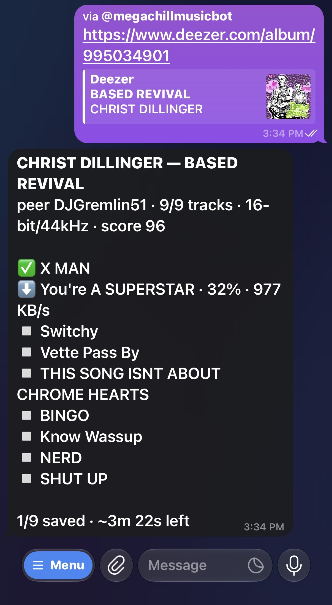
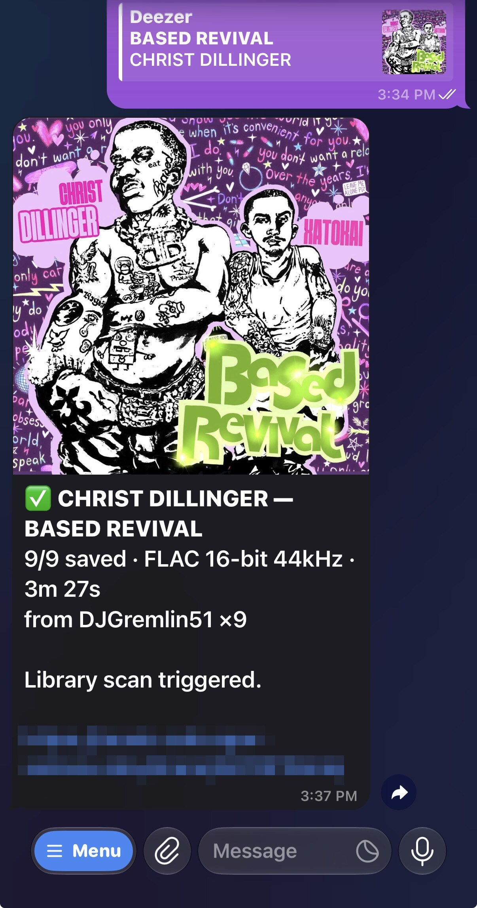
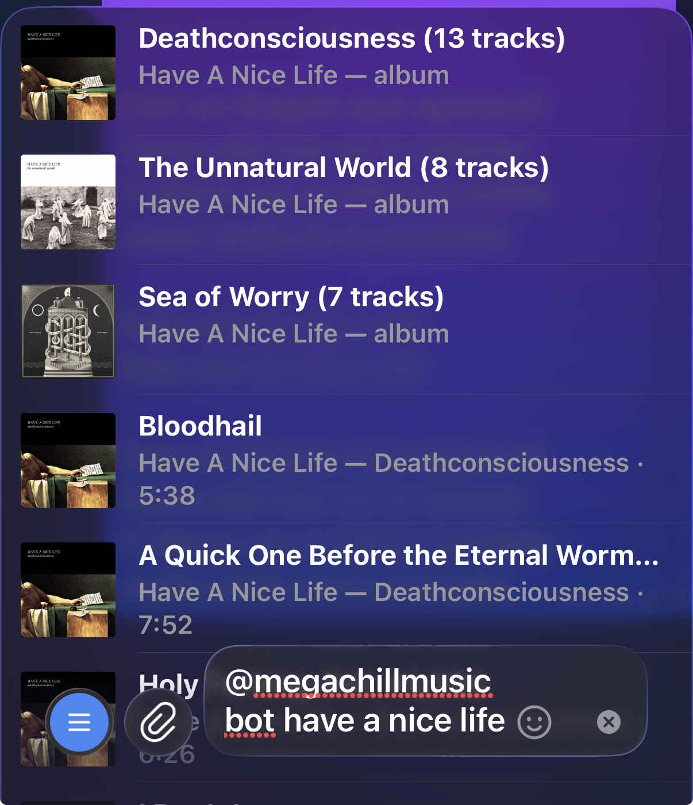
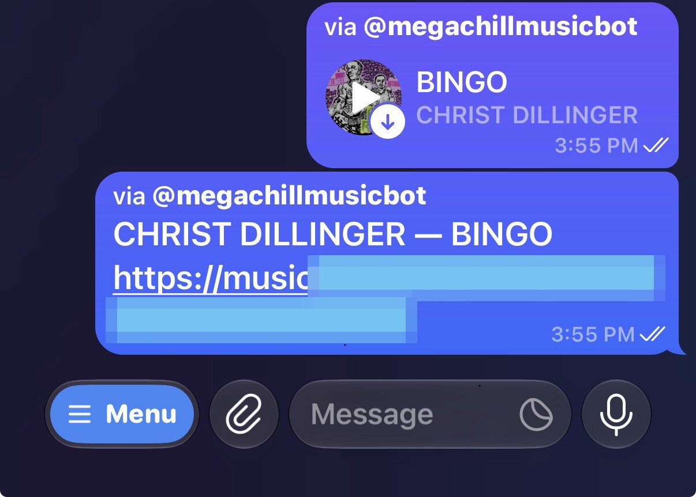
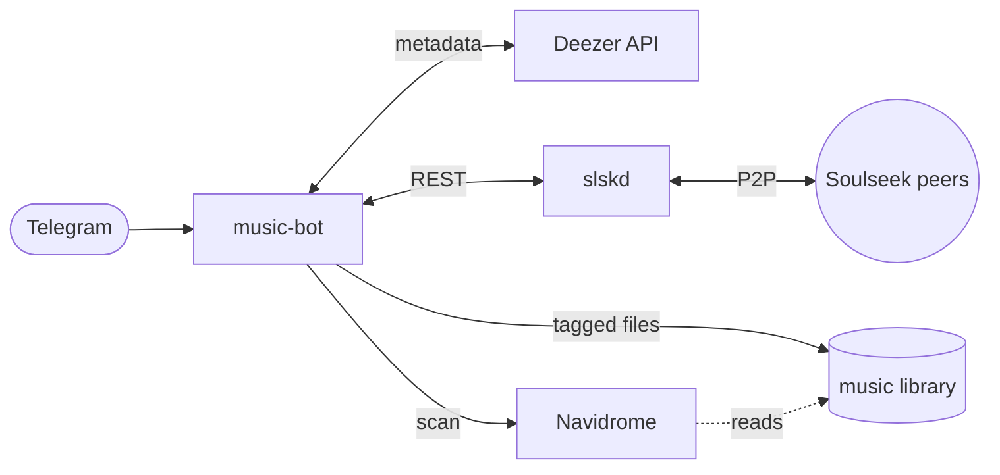
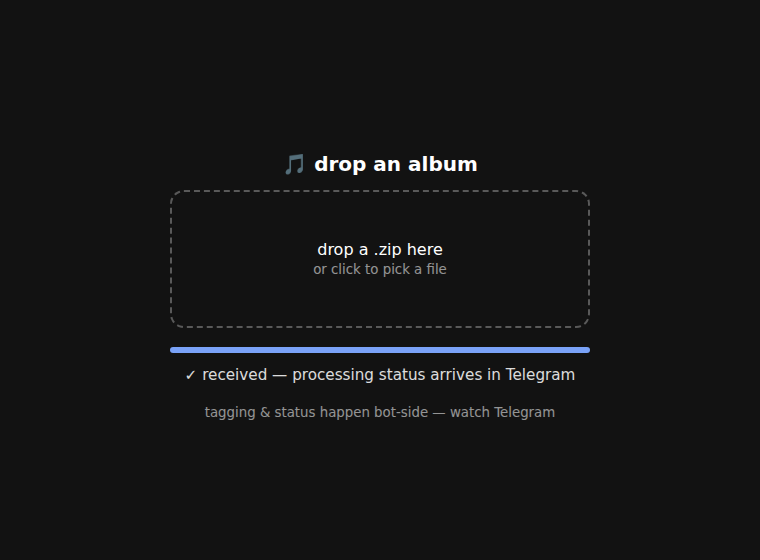

# Music Bot

A Telegram bot that fills your [Navidrome](https://www.navidrome.org/) library. Paste a link to an
album or track from almost any music service; the bot identifies it, finds the audio on
[Soulseek](https://www.slsknet.org/), tags it and moves the files into your library.

[](https://github.com/eeegoloauq/music-bot/releases/latest)
[](https://github.com/eeegoloauq/music-bot/actions/workflows/tests.yml)
[](LICENSE)

Metadata comes from [Deezer](https://www.deezer.com/)'s open API (no login or token). Downloads go
through [slskd](https://github.com/slskd/slskd).

<h2 align="center">Paste a link, get the album</h2>
<p align="center">
  
  
</p>
<p align="center"><sub>The bot edits one status message the whole way: which peer it picked, each track
as it lands, and what arrived in the end.</sub></p>

<h2 align="center">Search from any chat</h2>
<p align="center">
  
</p>
<p align="center"><sub>Type <code>@yourbot</code> and a name in any chat, tap a result — the download
starts. Turn inline mode on first: <code>/setinline</code> in @BotFather.</sub></p>

<h2 align="center">Share what you're playing</h2>
<p align="center">
  
</p>
<p align="center"><sub><code>np</code> sends the track you're playing as audio, <code>s</code> a share link
from your Navidrome, <code>l</code> the lyrics.</sub></p>

## What it can do

- Paste a link from Tidal, Spotify, Apple Music, Deezer, YouTube
  Music, SoundCloud, Amazon Music, or Shazam. You get FLAC with full metadata in your library.
- If no peer has a lossless copy, the bot offers you an mp3 (≥ 256 kbps) or
  m4a with a tap. It never downgrades quality without asking.
- Every candidate file is duration-checked against Deezer track by track and
  scored on match confidence and peer reliability before anything is queued. The full policy is
  written up in [docs/source-selection.md](docs/source-selection.md).
- Genres come from Deezer plus Last.fm community tags, so Navidrome gets tags like
  "witch house" or "future garage" instead of just "Electronic".
- `/retag` goes through everything you already have and refreshes the tags from
  current metadata, without touching the audio or your embedded cover art.
- Drop a zip on the built-in upload page or into a watched folder; it is identified, tagged and
  filed like any download. See [Local uploads](#local-uploads).
- Type `@yourbot` in any chat to search, share what you're playing, grab lyrics,
  or search your own library.
- Only the Telegram user IDs you list can use it.

## Setup

One compose stack with two services, slskd (the Soulseek client) and music-bot, talking over slskd's
REST API. The setup is two files, `compose.yaml` and `.env`, so it also works in Dockge or
Portainer. Settings live in `.env`. (No Docker?
See [Without Docker](#without-docker) below.)


```mermaid
flowchart LR
    tg([Telegram]) --> bot[music-bot]
    bot <-->|metadata| dz[Deezer API]
    bot <-->|REST| slskd[slskd]
    slskd <-->|P2P| peers((Soulseek peers))
    bot -->|tagged files| lib[(music library)]
    bot -->|scan| nd[Navidrome]
    nd -.reads.-> lib
```

### 1. `compose.yaml`

Use [`compose.yaml`](compose.yaml) from this repo as is. Its comments explain each setting:

```bash
curl -O https://raw.githubusercontent.com/eeegoloauq/music-bot/main/compose.yaml
```

### 2. `.env`

```env
TG_TOKEN=your_telegram_bot_token
ALLOWED_USERS=123456789

NAVIDROME_URL=http://host.docker.internal:4533
NAVIDROME_USER=admin
NAVIDROME_PASS=your_password

SOULSEEK_USERNAME=your_soulseek_username
SOULSEEK_PASSWORD=your_soulseek_password

# The folder where your music library lives. The bot's download staging area
# sits inside it, so the final move into the library is instant. Keep both on
# the same disk.
MUSIC_LIBRARY_DIR=/media/music

# Local-upload page (optional, see "Local uploads") — also uncomment the
# ports: lines in compose.yaml.
#UPLOAD_HTTP_PORT=8080
```

Both containers run as UID/GID 1000 by default. Set `MUSICBOT_UID` to the host
account that owns the bot state and `MUSICBOT_GID` to the group that owns the
music library. Group write comes from `umask 0002` in both containers, so new
files are created `0664` and directories `0775` and nothing chmods anything
afterwards. Do not also configure slskd `PUID`/`PGID` when using `user:`.
Pre-create `bot-data`, `slskd-config`, and the library's `.slskd-downloads` with
the selected UID/GID before the first start. See
[volume permissions](docs/volume-permissions.md) for existing installations and
rollback.

Then `docker compose up -d`.

A few things worth knowing:

- The image is multi-arch (amd64 + arm64), so a Raspberry Pi or an ARM VPS works fine.
- The **Soulseek peer port** (`50300` by default, or set `SLSKD_LISTEN_PORT`) needs a port forward on
  your router if you want incoming peer connections.
- If Navidrome runs in the **same compose stack**, use `NAVIDROME_URL=http://navidrome:4533`.
- slskd's web UI is on `127.0.0.1:5030` with no password — it's only reachable from inside the
  Docker network, don't expose it.

See [.env.example](.env.example) for every option, including proxy support and the quality cap.

### Without Docker

```bash
uv sync --frozen
cp .env.example .env   # fill it in
uv run python src/bot.py   # needs slskd running and reachable
```

## Using it

**Downloads** — just send a music link. Album or single track is auto-detected; paste several links
and they all queue up. Add `re` after a link to re-download something you already have (your existing
copy is kept safe until the new one finishes cleanly). Every status message carries a ✖ Cancel
button until the download is done — tracks already saved stay.

**Inline mode** — type `@yourbot` followed by:

| Query | What it does |
|---|---|
| `song name` | Search Deezer for albums and tracks |
| `np` | Send the track you're playing right now as audio |
| `s` | Share link for the current track |
| `l` | Lyrics for the current track |
| `lib name` | Search your own Navidrome library |
| `del name` | Remove an album from your library |

**Commands** — `/help`, `/scan` (rescan Navidrome), `/stats` (library size), and `/retag` (refresh
tags library-wide; shows a preview first, then `/retag confirm` to apply).

## Local uploads

<p align="center">
  
</p>

Music you already have can go in through the same tagging/dedup pipeline: drop a `.zip` (or a
folder of tracks) on the upload page (set `UPLOAD_HTTP_PORT` in `.env` and uncomment the
`ports:` lines in `compose.yaml`) or into `./bot-data/uploads/` (Samba or SFTP work too).
The release is identified from the files' own tags (embedded streaming URL, ISRC/UPC,
artist+album) or the zip name; if nothing matches, the bot says so and files nothing. Results
report to Telegram like any download.

The upload page has no auth — keep it LAN-only, or put a VPN / authenticated reverse proxy in
front.

## Configuration

The `.env` above covers most setups. Other variables and their defaults:

| Variable | Default | What it's for |
|---|---|---|
| `NAVIDROME_PUBLIC_URL` | — | Public Navidrome URL, needed for share links (also set `ND_ENABLESHARING=true` in Navidrome) |
| `LASTFM_API_KEY` | — | Adds Last.fm community tags to genres. [Free key](https://www.last.fm/api/account/create) |
| `MAX_BIT_DEPTH` / `MAX_SAMPLE_RATE_HZ` | `24` / `96000` | Skip peer files above this quality. Use `16` / `44100` for CD-quality only |
| `MAX_FILE_BYTES` | `2147483648` | Reject any single peer file bigger than this (2 GiB). `0` turns it off |
| `SLSKD_LISTEN_PORT` | `50300` | Soulseek peer port (forward it on your router) |
| `UPLOAD_HTTP_PORT` | — | Enables the local-upload page on this port (off when unset) |
| `UPLOAD_MAX_TOTAL_BYTES` | `10737418240` | Cap on one upload after extraction (10 GiB) |
| `STREAM_BITRATE` | `320` | mp3 bitrate for the `np` inline audio |
| `HTTP_PROXY` / `HTTPS_PROXY` / `NO_PROXY` | — | Standard proxy vars are respected. If one upstream throttles your proxy IP, add its host to `NO_PROXY` to send just that one direct |

## How files get tagged

Every download is tagged from Deezer: artist, album, title, track and disc numbers, date,
ISRC, label, genres (Deezer + Last.fm), ReplayGain, embedded cover art, and synced lyrics from
[lrclib](https://lrclib.net). FLAC, M4A, and mp3 are all handled.

On download the bot replaces whatever tags the peer's file came with, so your library stays
consistent. `/retag` only changes fields that are wrong and leaves the rest, including cover art, as is.

Versions before 3.0.2 wrote titles like `Song (Remix) ((Remix))`. To repair an existing library,
from the directory that holds `compose.yaml`:

    docker compose run --rm --no-deps -v "$PWD/scripts:/scripts:ro" \
        music-bot python /scripts/fix-doubled-title-version.py --apply

Without `--apply` it only lists what it would change.

## Contributing

Issues and PRs are welcome. [CONTRIBUTING.md](CONTRIBUTING.md) covers the dev setup and
guidelines. The test suite runs fully offline (slskd and all network calls are stubbed), so
`uv run pytest` needs no credentials and no containers. For anything bigger than a fix, open an
issue first.

## Legal

Soulseek is a peer-to-peer network, and much of what people share on it is copyrighted. Whether
downloading any given file is legal depends on the file and on where you live. In most places,
downloading music you haven't bought isn't. This bot only automates [slskd](https://github.com/slskd/slskd);
what you fetch with it is your responsibility. Use it to preview music before buying, to fill gaps
in albums you own, or wherever your local law allows, and support the artists you listen to.

## License

[MIT](LICENSE).
